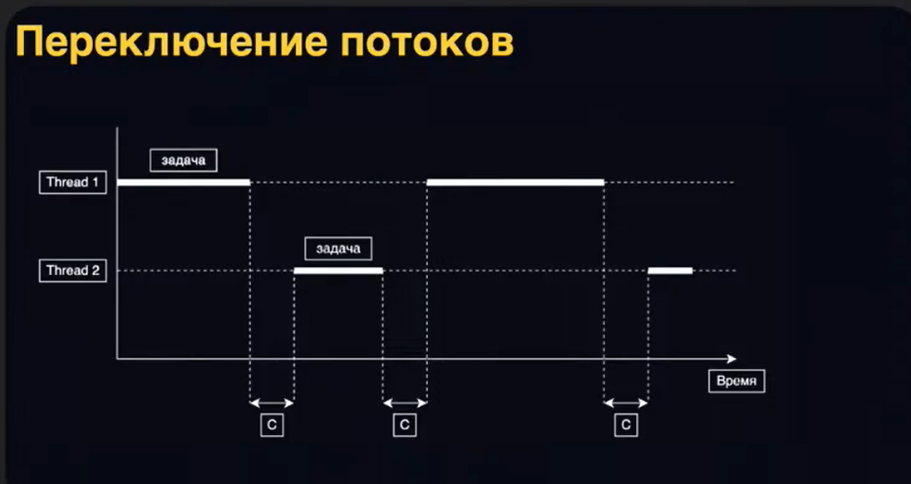
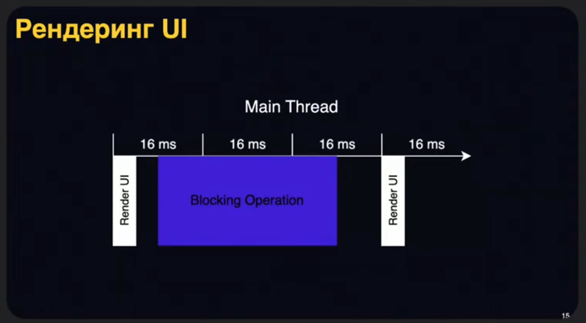
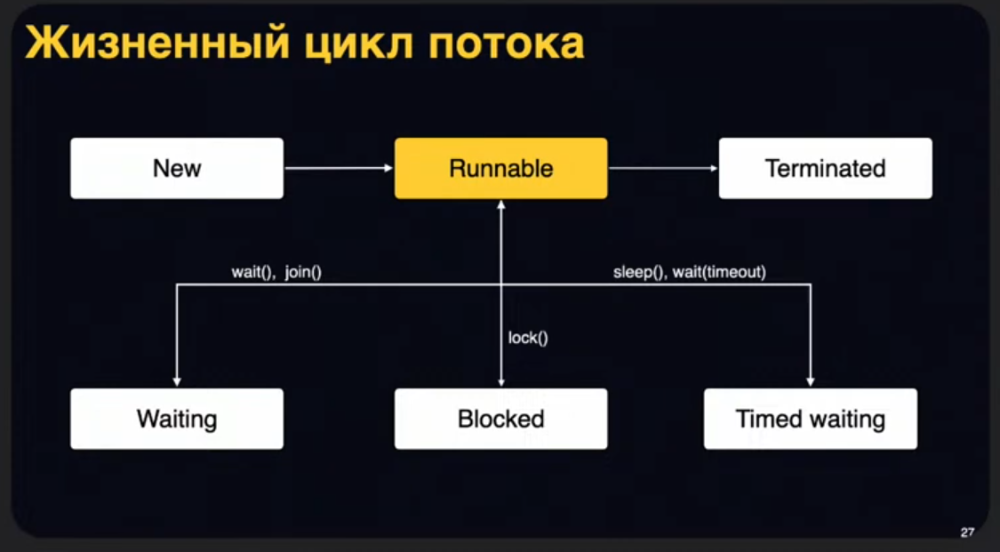
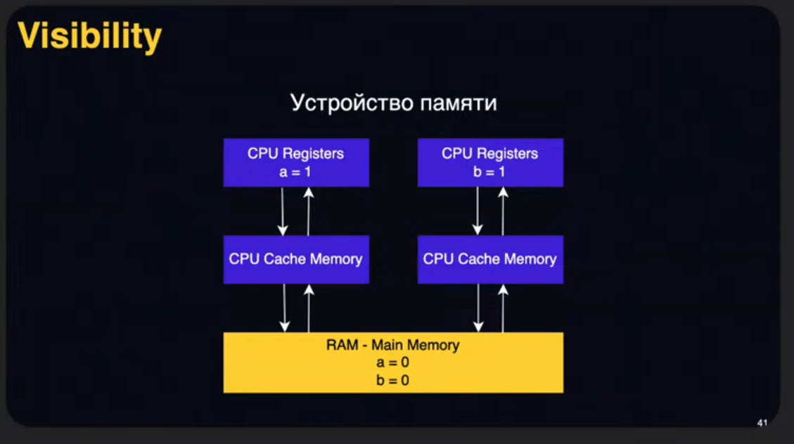

# План
1. Foundamentals
2. Threads
3. java.util.concurrent
4. Android

Обсудим базовые понятия в мире многопоточности, поймём, что такое процесс, что такое поток, рассмотрим примеры того, как можно потоки создавать/отменять, как ими управлять

Далее рассмотрим основные примитивы синхронизации, которые я использую на практике, классные коллекции из java.util.concurrent, которые сильно упрощают нам жизнь в ежедневной android разработке

На последок немного затронем тему конкретно Android фреймворка, поймём, какие инструменты есть именно в нём и что мы можем использовать для себя

# Содержание

- [План](#план)
- [Содержание](#содержание)
- [`1.` Foundamentals](#1-foundamentals)
  - [`1.1` Иерархия процессов](#11-иерархия-процессов)
  - [`1.2` Потоки внутри процесса](#12-потоки-внутри-процесса)
  - [`1.3` Переключение потоков](#13-переключение-потоков)
  - [`1.4` Зачем нужна многопоточность?](#14-зачем-нужна-многопоточность)
    - [Специфика Android](#специфика-android)
      - [Рендеринг UI](#рендеринг-ui)
      - [ANR](#anr)
  - [`1.5` Вывод: основные плюсы многопоточного кода](#15-вывод-основные-плюсы-многопоточного-кода)
- [`2.` Threads](#2-threads)
  - [`2.1` Создание потока, `Thread()`, `start()`](#21-создание-потока-thread-start)
  - [`2.2` Полезные функции](#22-полезные-функции)
    - [`currentThread()`](#currentthread)
    - [Наследование от Thread и `override run()`](#наследование-от-thread-и-override-run)
    - [`kotlinc.concurrent.thread()`](#kotlincconcurrentthread)
  - [`2.3` Не путать run() и start()](#23-не-путать-run-и-start)
  - [`2.4` Жизненный цикл потока](#24-жизненный-цикл-потока)
  - [`2.5` Остановка потока](#25-остановка-потока)
    - [Кооперативная отмена, `isInterrupted`](#кооперативная-отмена-isinterrupted)
    - [Отмена во время ожидания, `Thread.sleep()`, `InterruptedException`](#отмена-во-время-ожидания-threadsleep-interruptedexception)
  - [`2.6` Ожидание завершения потока, `join()`](#26-ожидание-завершения-потока-join)
  - [`2.7` Запуск нескольких потоков](#27-запуск-нескольких-потоков)
    - [`Race condition`](#race-condition)
    - [`Reordering`](#reordering)
    - [`Visibility`](#visibility)
  - [`2.8` Java Memory Model](#28-java-memory-model)
    - [`Synchronized`](#synchronized)
    - [JMM guarantees](#jmm-guarantees)
    - [Очень важная особенность `Reentrant`](#очень-важная-особенность-reentrant)
    - [`Thread-safe ObserverList`](#thread-safe-observerlist)
    - [android.app.Activity](#androidappactivity)
    - [`java.util.Collections`](#javautilcollections)
    - [`Volatile`](#volatile)
      - [`Kotlin Lazy`](#kotlin-lazy)
    - [`Immutability`](#immutability)
- [`3.` `java.util.concurrent`](#3-javautilconcurrent)
  - [`3.1` `Lock`](#31-lock)
    - [`ObserverList` with Lock](#observerlist-with-lock)
    - [`Atomic`](#atomic)
      - [`AtomicBoolean`](#atomicboolean)

# `1.` Foundamentals

Этот доклад лишь приоткроет дверь в мир многопоточности, и чтобы действительно научиться писать классный многопоточный код, нужно прочитать большой объём литературы и, самое главное, нужно много практиковаться. В этой теме без практики никуда и вы только по ходу дела, по ходу решения сложных кейсов из мира программирования будете улучшать свои навыки и понимать, когда можно использовать тот или иной инструмент/механизм из многопоточки

Сегодня как раз постараюсь привести примеры, которые смогут вам с этим помочь

`Многопоточность` – способность процессора обеспечивать одновременное выполнение нескольких потоков внутри одного процесса

`Процесс` – экземпляр программы во время выполнения. Независимый объект, которому выделены системные ресурсы. Для нас, как андроид-разработчиков, это означает, что есть конкретное приложение и в рамках этого приложения существует процесс

В рамках процесса существуют `потоки выполнения` – определённые способы выполнения процесса. По сути, это набор инструкций, которые выполняются последовательно

## `1.1` Иерархия процессов

OS Android – система на базе Linux, соответственно, можно рассмотреть нашу концепцию процессов с точки зрения линукса

Под процессами можно считать конкретные приложения, хотя у одного приложения могут быть несколько процессов

```
Linux Kernel

    Process A
        PID (process id)
        Address Space
        Memory

    Process B
        PID
        Address Space
        Memory

    Process C
        PID
        Address Space
        Memory
```

## `1.2` Потоки внутри процесса

Внутри процесса будут существовать наши потоки

```
Process A
    
    Thread 1
    
    Thread 2
    
    Thread 3
```

Потоки – это часть процесса, они делят общую память между собой

Тема многопоточности как раз и раскрывает проблему работы с общими данными для потоков и пытается решить многие проблемы, когда мы пытаемся из одного потока получить данные, над которыми работает другой поток

При использовании многоядерных устройств отдельные ядра (грубо говоря, отдельные процессоры) будут работать с нашими процессами, причём могут затрагивать потоки одного и того же процесса по-отдельности. Мы должны это тоже учитывать:

```
        Thread A1   |   Thread B1
CPU 1
        Thread A2   |   Thread B2

---------------------------------

        Thread A3   |   Thread B3
CPU 2
        Thread A4   |   Thread B4

---------------------------------

        Process A   |   Process B
```

## `1.3` Переключение потоков

**Количество потоков не всегда будет улучшать эффективность вашей программы, поскольку потоки работают последовательно в рамках одного процесса**:



Если есть несколько потоков, и они живут в рамках одного конкретного процесса, и обрабатываются на одном ядре, то инструкции в этих потоках будут выполняться не параллельно, а последовательно

То есть сначала выполняем некоторый участок кода в Потоке 1, потом переключаемся в Поток 2, возвращаемся к первому / переключаемся на другие потоки и т.д.

То есть потоки внутри процесса работают **последовательно** 

И есть некоторые зазоры между выполнениями задач на том или ином потоке, эти промежутки супер важны. Это то время, которое нужно диспатчеру, чтобы переключиться с одного потока на другой

Если потоков будет не 2, а 1000, то таких промежутков будет сильно больше

То, сколько нужно потоков для максимальной эффективности, можно описать с помощью определённых законов. Например, как Universal Scalability Law – универсальный закон масштабируемости. Можете немножко про это почитать и чуть-чуть углубиться в эту тему

Вывод: не всегда количество потоков будет улучшать эффективность вашей программы. Тут нужно находить баланс

## `1.4` Зачем нужна многопоточность?

Однопоточный код не решает все наши проблемы и задачи

Однопоточные программы имеют недостатки в случаях, когда требуется обработка различных событий и выполнение блокирующих задач

### Специфика Android

В Android наше приложение живёт в одном или более процессах, каждое из которых содержит основной поток под названием `Main Thread`

Он отвечает сразу за несколько важных активностей:
1. В первую очередь, он и только он должен отрисовывать UI
2. Далее он может обрабатывать какие-то пользовательские действия: нажатия, свайпы
3. Более того, он и только он отвечает за запуск всех основных компонентов (Activity, ContentProvider, BroadcastReciever, Services)

Как минимум то, что уже перечислено, довольно фундаментальные вещи и под них должно быть выделено много времени. На бэкграунд задачи может не хватить времени на главном потоке

#### Рендеринг UI

Рассмотрим одну из базовых активностей главного потока – отрисовку UI. Главная загвоздка здесь – это уметь вовремя отрисовывать каждый кадр, который пользователь видит на экране

На современных дейвайсах это может быть 60 или 120 кадров в секунду. Соответственно, нам нужно за каждые 1000/60 ~ 16 миллисекунд уметь формировать и отрисовывать весь кадр для UI

В случаях, когда основной поток не готов это сделать, мы будем терять кадры – приложение будет лагать



#### ANR

В случае, если мы заблокируемся слишком надолго, на несколько секунд, то можем вообще словить ошибку `Application Not Responding` и пользователь может взять и удалить наше приложение, т.к. оно не соответствует уровню современных производительных приложений

Мы этого не хотим, поэтому нужно придумать помощников основному потоку – бэкграунд потоки, которые на себя возьмут походы в сеть, походы в базу данных, сложную бизнес-логику в приложении

Всё это должно быть выделено в отдельные бэкграунд потоки и выполняться только там. Тогда у основного потока всё будет хорошо

## `1.5` Вывод: основные плюсы многопоточного кода

1. Эффективное использование ядер
2. Отзывчивость
3. Повышение производительности

# `2.` Threads

Мы разобрали для чего нужна многопоточность и что такое процесс и потоки. Давайте теперь научимся работать с ними

## `2.1` Создание потока, `Thread()`, `start()`

Это супер просто, так же как и любой другой объект в котлин или джава, мы можем создать объект класса Thread

```kotlin
fun main() {
  val thread = Thread()
}
```

Но просто так магии не произодойдёт, нужно передать какую-то логику. Её можно передать в конструкторе:

```kotlin
fun main() {
  val thread = Thread {
    println("Hello world!")
  }
}
```

Но даже после этого никакого потока не будет запущено, мы только создали объект. Поток нужно *запустить*:

```kotlin
fun main() {
  val thread = Thread {
    println("Hello world!")
  }

  thread.start()
}
```

Только после этого со стороны ОС будут выделены ресурсы и время для исполнения, диспатчер будет знать про этот поток и будет на него переключаться, когда будет возможность

## `2.2` Полезные функции

### `currentThread()`

Есть статичная функция currentThread() у класса Thread, которая позволяет вытащить объект текущего потока, в котором мы исполняемся

```kotlin
fun main() {
  val thread = Thread {
    val threadName = Thread.currentThread().name
    println("Hello from: $threadName!")
  }

  thread.start()
}
```

Это бывает полезно для дебага

### Наследование от Thread и `override run()`

Ещё с джавы можно наследоваться от класса Thread и переопределять функцию run(). Она будет вызвана при запуске потока и внутри неё присходит вся бизнес-логика

```kotlin
fun main() {
  val thread = object : Thread() {
    override fun run() {
      val threadName = Thread.currentThread().name
      println("Hello from: $threadName!")
    }
  }

  thread.start()
}
```

Такой способ я не особо рекомендую, есть более простые варианты

### `kotlinc.concurrent.thread()`

factory метод котлина, которая по умолчанию сразу запускает поток

```kotlin
import kotlin.concurrent.thread

fun main() {
  val thread = thread {
    val threadName = Thread.currentThread().name
    println("Hello from: $threadName!")
  }
}
```

## `2.3` Не путать run() и start()

У потока функцию run() можно переопределить, а можно ещё и вызвать. Но тогда магии не произойдёт, мы банально вызовем эту функцию у объекта, без создания нового потока

```kotlin
fun main() {
  val thread = Thread {
    val threadName = Thread.currentThread().name
    println("Hello from: $threadName!")
  }

  thread.run()
}
```

## `2.4` Жизненный цикл потока



1. Состояние `New`, когда поток мы просто создали, но не запускали
2. Состояние `Runnable`, когда поток находится в активной фазе работы и сейчас исполняет какую-то бизнес-логику
3. Состояние `Terminated`, когда он завершил свою работу и прекратил существование

Есть ещё промежуточные состояния, когда он блокируется по тем или иным причинам:
 1. `Waiting`: wait(), join()
 2. `Blocked`: lock()
 3. `Timed waiting`: sleep(), wait(timeout)

Я бы сказал, что можно это сейчас объединить в один блок и сказать, что у нас всего лишь есть возможность попасть в состояние, когда поток блокируется и ничего активно не выполняет, а ждёт отмашки от какого-то другого потока, чтобы проснуться. Мы рассмотрим такие случаи

## `2.5` Остановка потока

Главное, что стоит знать, – у потока есть функция `interrupt()`, которая опишет наше намерение остановить этот поток

```kotlin
import kotlin.concurrent.thread

fun main() {
  val thread = thread {
    // do some work
  }

  // we want to stop new thread
  thread.interrupt()
}
```

Что я имею в виду? Рассмотрим пример.

Поток долго делает какую-то сложную работу, а в другом месте мы пытаемся его приостановить:

```kotlin
import kotlin.concurrent.thread

fun main() {
  val thread = thread {
    repeat(100000) { index ->
      // do heavy work
      println("index: $index")
    }
  }

  // we want to stop new thread
  thread.interrupt()
}
```

Код выше не сработает, потому что **остановка потоков кооперативная**

### Кооперативная отмена, `isInterrupted`

Что это значит: остановка потока предполагает, что **поток должен быть готов для отмены**, чтобы избежать ситуации резкой остановки и потери связи (с базой данных и т.п.)

Сам поток должен следить за тем, что его кто-то извне пытается приостановить, и реагировать на это – освобождать ресурсы и выходить из функции run()

Код ниже уже сработает правильно

```kotlin
import kotlin.concurrent.thread

fun main() {
  val thread = thread {
    repeat(100000) {
      val thread = Thread.currentThread()
      if (!thread.isInterrupted) {
        // do heavy work
      } else {
        // clear resources
      }
    }
  }

  // we want to stop new thread
  thread.interrupt()
}
```

Это один из основных вариантов того, как останавливать поток

### Отмена во время ожидания, `Thread.sleep()`, `InterruptedException`

Альтернативный способ, когда мы находимся в одной из блокирующих функций. Для примера внизу функция Thread.sleep()

```kotlin
import kotlin.concurrent.thread

fun main() {
  val thread = thread {
    repeat(100000) {
      try {
        Thread.sleep(1000)
        // do heavy work
      } catch (e: InterruptedException) {
        // clear resources
      }
    }
  }

  // we want to stop new thread
  thread.interrupt()
}
```

Thread.sleep() довольно часто может использоваться на практике (обычно в тестах), когда мы явно говорим потоку приостановить своё выполнение и заснуть на несколько (в данном случае на секунду). Пока поток находится в этом состоянии ожидания, его можно приостановить, он выкинет исключение `InterrutpedException`, мы его ловим, чистим ресурсы и выходим из run() насовсем

Это два основных ключевых варианта реагирования на отмену. Пожалуйста, пользуйтесь ими и запомните

## `2.6` Ожидание завершения потока, `join()`

Мы научились создавать и приостанавливать потоки. Давайте теперь научимся их синхронизировать и дожидаться работы. Это часто бывает нужно, посмотрим в примерах когда и зачем

```kotlin
import kotlin.concurrent.thread

fun main() {
  val thread = thread {
    Thread.sleep(2000)
    println("end of thread")
  }

  // wait for thread completion
  thread.join()

  println("end of main")
}
```

В коде выше с помощью функции `join()` мы на главном потоке дожидаемся завершения выполнения потока thread и только потом печатаем "end of main" 

## `2.7` Запуск нескольких потоков

Внизу логика та же самая, создали два потока, чуть-чуть подождали, напечатали две строчки, на главном потоке дождались:

```kotlin
import kotlin.concurrent.thread

fun main() {
  val thread1 = thread(name = "thread1") {
    Thread.sleep(1000)
    println("end of thread: ${Thread.currentThread().name}")
  }

  val thread2 = thread(name = "thread2") {
    Thread.sleep(2000)
    println("end of thread: ${Thread.currentThread().name}")
  }

  thread1.join()
  thread2.join()

  println("end of main")
}
```

Никакой магии

До этого мы работали с потоками как с изолированными элементами, которые не взаимодействовали друг с другом никак. Начнём теперь погружаться в сложности работы

### `Race condition`

Рассмотрим пример:

```kotlin
import kotlin.concurrent.thread

fun main() {
  var a = 0
  var b = 0

  val thread1 = thread {
    a = 1
    println(b)
  }

  val thread2 = thread {
    b = 1
    println(a)
  }
}
```

Если задумаемся, что будет выведено в консоли, вариантов будет много:

Отработал первый, второй увидел новое значение
```
1
0
```

Оба потока работают почти впараллели, оба присвоили единички и напечатали
```
1
1
```

Бывают и такие случаи как ниже, о них мы поговорим чуть позже
```
0
1
```
```
0
0
```

Мы их можем получить из-за того, что мы никак не защитили переменные от многопоточного вмешательства и нет никаких гарантий насчёт видимости

Например, оба потока могут не увидеть актуального значения в силу того, что у каждого из потоков есть свой набор кешей, в котором они могут хранить текущее значение и не отдавать эти значения другим потокам

Эта картина, когда результат зависит от того, в какой момент тот или иной поток начал выполнять свою работу, называется `race condition`. Наверное, многие этот термин встречали, он используется не только в котлин, джаве и андроид, но и, кажется, во всех основных современных языках программирования

**Резюмируя**: стоит знать, что в многопоточном коде есть определённые правила и оптимизации со стороны самого компилятора. Например, он может менять местами инструкции в коде (instructions reordering); он может учитывать, что видимость переменных не гарантирована

Попробуем понять, как с этим работать

### `Reordering`

Посмотрим на ситуацию глазами самого компилятора

```kotlin
import kotlin.concurrent.thread

fun main() {
  var a = 0
  var b = 0

  val thread1 = thread {
    a = 1
    println(b)
  }

  val thread2 = thread {
    b = 1
    println(a)
  }
}
```

Если бы у нас на руках были строчки только первого потока, нам никто бы не мешал поменять местами строчки присваивания и печати – они не влияют друг на друга

```kotlin
val thread1 = thread {
  println(b)
  a = 1
}
```

На результат это не повлияет. Но в многопоточной среде без дополнительной синхронизации это точно повлияет на результат и может негативно сказаться на общем состоянии программы

С этой проблемы надо как-то бороться и давать гарантии внутри кода

### `Visibility`

Как уже было сказано, у каждого потока может быть своя система кеш-линий, в которых он будет хранить актуальные значения



В нашем примере они могут сохранить актуальные значения у себя на регистрах, а в основную память эти значения не отправлять

## `2.8` Java Memory Model

Мы рассмотрели ключевые моменты в многопоточности и уже в простейших примерах столкнулись с проблемами при работе с разделяемыми данными и ресурсами, получая состояния, которые мы не контролируем

Как с этим бороться? У нас есть поддержка со стороны языка – спецификации под названием `Java Memory Model`. Это модель памяти, которая описывает, какие могут быть оптимизации у компилятора, у JVM в целом и у процессора

1. Часть спецификации языка
2. Описывает отношение между кодом и виртуальной памятью
3. Закрепляет условия видимости изменений
4. Определяет атомарность определённых операций (когда один поток может посмотреть на работу другого потока, но не сможет вклиниться где-то посередине. То есть он будет видеть либо результат работы до старта потока, либо после)

Все спецификации по языку есть по этой ссылке

https://docs.oracle.com/javase/specs/jls/se21/html/jls-17.html#jls-17.4

После сегодняшей лекции будет классным домашним заданием разобраться, какие правила там заложены и какие гарантия есть при соблюдении спецификации java memory модели

Сегодня мы рассмотрим основные концепции оттуда и поймём, как с ними работать

### `Synchronized`

Одна из основных концепций, ключевых конструкций, которая поддерживает принципы java memory модели. Она даёт нам много гарантий, про которые можно почитать по ссылке. Но сегодня рассмотрим работу с synchronized секцией на примерах и покажем, что можно с их помощью сделать

```kotlin
fun main() {
  val lock = Any()

  synchronized(lock) {
    // some code with shared resource
  }
}
```

Вообще, это такой участок кода, который защищает доступ к многопоточной работе. Он позволяет только одному потоку получить доступ к коду внутри фигурных скобок и не даёт возможность зайти другим потокам, пока кто-то находится внутри synchronized секции, внутри критической секции

> **Аналогия**: защищённая комната и ключ к ней 
> 
> Если у вас есть ключ, вы можете зайти в комнату, и пока вы находитесь там, никто другой в эту комнату зайти не сможет

`synchronized(lock)` можно вызывать с любым объектом `lock`, ещё с первой версии джавы любой объект считается ключом

Этот объект ещё называют `mutex` (mutual exclusion). Обычно сюда передаётся объект класса Any, либо какой-то конкретный instance лока, который мы явно объявили заранее, или может быть использовали из пакета java.util.concurrent, который разберём чуть позже

Он важен. Для чего? Представим, что у нас есть только одна копия ключей и мы можем зайти в защищённую комнату. Но в случае, если кто-то другой сделает дупликат (создаст новый lock класса Any) и передаст его в synchronized секцию, то у нас начнутся проблемы: несколько потоков смогут зайти в эту секцию и друг другу помешать

Этого нельзя допускать. Важно делать так, чтобы к разделяемому ресурсу у нас был доступ только по определённому локу и этот лок мы должны везде использовать

Давайте рассмотрим предыдущий пример и применим эту концепцию:

```kotlin
import kotlin.concurrent.thread

fun main() {
  var a = 0
  var b = 0
  val lock = Any()

  val thread1 = thread {
    synchronized(lock) {
      a = 1
      println(b)
    }
  }

  val thread2 = thread {
    synchronized(lock) {
      b = 1
      println(a)
    }
  }
}
```

Мы обернули работу с переменными a и b внутри секции

На что здесь обратить внимание: важно, что у нас есть два объекта, a и b, которые являются разделяемыми ресурсами (то есть они шарятся между несколькими потоками), и важно защищать доступ к этим переменным как при чтении, так и при записи, и оборачивать в synchronized секции. Только благодаря этому у нас появится возможность безопасно работать с переменными a и b и получать всегда актуальные значения этих переменных

Однозначный вывод, потому что у нас есть гарантии по работе потоков:
```
0
1
```

Какие именно гарантии: в synchronized секции (в данном случае их 2 штуки) мы заходим по одному и тому же ключу, соответственно не важно, какой из потоков первый зайдёт в одну из секций, только он и будет там находиться и только там будет работать. А второй поток при попытке зайти по тому же ключу перейдёт в режим ожидания до тех пор, пока не дадут возможность зайти

И получается нам не важно, второй поток сначала выполнил работу и потом первый, или наоборот, результат будет один и тот же: сначала присваиваем 1, потом печатаем второе значение, затем делаем аналогичное действие в другом потоке

**Резюмируя**:
1. Для блокировки используется lock (mutex)
2. Доступ к данным должен быть защищён одим и тем же lock'ом (ключ должен быть одинаковый при работе с одним и тем же разделяемым ресурсом)
3. Блокировать надо как чтение, так и запись

### JMM guarantees

Можно получить гарантии и писать многопоточный код даже без сложных конструкций типа synchronized секций:

```kotlin
fun main() {
  val thread1 = thread {
    a = 1
  }

  val thread2 = thread {
    b = 1
  }

  thread1.join()
  thread2.join()

  println(a)
  println(b)
}
```

```
1
1
```

### Очень важная особенность `Reentrant`

Это свойство, позволяющее внутри synchronized секции зайти снова в ту же секцию по тому же ключу

```kotlin
fun main() {
  val lock = Any()

  fun check() = synchronized(lock) {
    println("before sync block")

    synchronized(lock) {
      println("inside sync block")
    }
  }

  check()
}
```

Если бы этого свойства не было, поток заблокировался бы при попытке зайти во вторую секцию и вторая строчка не напечаталась бы

Такой случай на практике называется `deadlock`'ом, он бывает как для одного потока, так и для нескольких. Это случай, когда мы блокируемся при попытке войти в какую-то критическую секцию и пытаемся дождаться от кого-то другого доступа к этой секции, но так его никогда и не получим

Бывают ещё `livelock`'и, но в данной лекции мы их рассматривать не будем. Они специфичны и появляются на практике сильно позже, после того как вы напишете действительно сложный многопоточный код и будете использовать сразу несколько mutex'ов для синхронизации ваших данных

Забегая вперёд к корутинам, у них есть свой аналог mutex'а и там этого свойства reentrant нет

### `Thread-safe ObserverList`

Попробуем понять, как с этим работать на практике, рассмотрим примеры, которые вы можете уже написать в своих приложениях

Я в яндексе собеседую студентов-стажёров в том числе и часто бывает, что даю задачу на многопоточность и привожу в пример практически тоже самое, что код ниже. И часто вижу, что ребята не понимают, как можно работать с простыми интерфейсами, простыми классами в многопоточной среде и как обеспечить простые гарантии безопасности. Давайте убедимся, что тут всё легко

```kotlin
interface Observer {
  fun onChanged()
}

interface Observable {
  fun registerObserver(observer: Observer)
  
  fun unregisterObserver(observer: Observer)
  
  fun notifyObservers()
}
```

У нас есть два интерфейса – наблюдаемый объект и наблюдатель/слушатель. Типичный кейс в андроид разработке. У наблюдателя есть единственная функция, какой-то callback, который можно дёрнуть в любой момент. А у наблюдаемого объекта есть несколько функций по регистрации, дерегистрации и оповещению всех слушателей

Давайте сначала попробуем реализовать этот интерфейс наивно:

```kotlin
class ObservableUnsafe : Observable {

  private val observers: MutableSet<Observer> = mutableSetOf()

  override fun registerObserver(observer: Observer) {
    observers.add(observer)
  }

  override fun unregisterObserver(observer: Observer) {
    observers.remove(observer)
  }

  override fun notifyObserver() {
    observers.forEach { observer -> observer.onChanged() }
  }
}
```

Мы придумываем какую-то коллекцию, которая бы хранила список слушателей. Здесь для примера множество MutableSet. А все функции следующим образом: при регистрации добавлять, при дерегистрации находить и удалять, при оповещении проходить по всем и вызывать callback

Такая реализация будет работать только в однопоточной среде. Если будем вызывать эти функции в нескольких потокаХ, то чуть ли не сразу же получим ошибки и exception'ы в рантайме, потому что кто-то может начать регистрировать новых слушателей, одновременно кто-то начнёт этих слушателей удалять, а ещё к тому же кто-то начнёт по всем текущим проходить и поймёт, что текущее состояние множества неконсистентно и кинет исключение

Мы этого допускать не хотим, мы хотим дать какие-то гарантии по работе с нашим множеством. Как это сделать:

```kotlin
class ObservableSafe : Observable {

  private val lock: Any = Any()
  private val observers: MutableSet<Observer> = mutableSetOf()

  override fun registerObserver(observer: Observer) {
    synchronized(lock) {
      observers.add(observer)
    }
  }

  override fun unregisterObserver(observer: Observer) {
    synchronized(lock) {
      observers.remove(observer)
    }
  }
  
  override fun notifyObserver() {
    synchronized(lock) {
      observers.forEach { observer -> observer.onChanged() }
    }
  }
}
```

Мы в данном случае понимаем, что у нас есть ровно один разделяемый ресурс – наше множество. Теперь наша задача понять, как с этим множеством работать в многопоточной среде. Нужно защитить как чтение (оповещения), так и запись (добавление, удаление)

Создаём lock, используем его для доступа к synchronized секции. Банально каждую функцию из предыдущего примера оборачиваем в synchronized секцию

Даже такой простой пример уже будет работать в многопоточной среде. Да, неэффективно, но будет работать и это уже позволит на таком простом уровне решить проблему

Но я хочу остановиться на функции notifyObservers(), потому что здесь есть важный нюанс: мы не знаем реализацию функции onChanged(). Там может быть поход в свою базу данных, какая-то блокировка, поход в ещё какую-то критическую секцию

Особенность функции в том, что мы не знаем и не гарантируем то, когда она будет до конца исполнена, а это повлияет на работу других потоков при обновлении данных

Это на самом деле проблема, которую мы можем элегантно решить

Наша задача, ведь, в данном случае, безопасно обратиться к множеству и прочитать данные оттуда. Давайте этим и займёмся:

```kotlin
override fun notifyObserver() {
  val observersCopy = synchronized(lock) {
    observers.toList()
  }
  observersCopy.forEach { observer -> observer.onChanged() }
}
```

Мы внутри секции не будем вызывать callback, но получим текущую копию множества, а дальше отпустим lock другим потокам и пройдём по копии, вызывая у них callback

Вот такой вариант уже будет и эффективный и безопасный

### android.app.Activity

Такая концепция используется не только в этом синтетическом примере, а и на проде буквально в каждом приложении, которое у нас есть

Здесь для примера код из android.app.Activity, где мы работаем с callback'ами

```java
public void registerActivityLifecycleCallbacks(
  Application.ActivityLifecycleCallbacks callback
) {
  synchronized (mActivityLifecycleCallbacks) {
    mActivityLifecycleCallbacks.add(callback);
  }
}

public void unregisterActivityLifecycleCallbacks(
  Application.ActivityLifecycleCallbacks callback
) {
  synchronized (mActivityLifecycleCallbacks) {
    mActivityLifecycleCallbacks.remove(callback);
  }
}

private Object[] collectActivityLifecycleCallbacks() {
  Object[] callbacks = null;
  synchronized (mActivityLifecycleCallbacks) {
    if (mActivityLifecycleCallbacks.size > 0) {
      callbacks = mActivityLifecycleCallbacks.toArray();
    }
  }
  return callbacks;
}
```

Таких примеров много, я привёл тот, который буквально лежит в исходниках android.app.Activity

### `java.util.Collections`

Что ещё – есть возможность использовать готовые функции из java.util.Collections, это стандартная библиотека из джавы, в котлине у нас так же есть возможность туда обратиться

Она позволяет, используя ваш текущий тип коллекции (список, мап, ...), обернуть эти коллекции в synchronized варианты:

```kotlin
public class Collections {
  ...
  public static <T> List<T> synchronizedList(List<T> list)

  public static <K, V> Map<K, V> synchronizedMap(Map<K, V> m)
}
```

По факту там происходит ровно то, что мы с вами видели: есть определённый делегат, который с помощью mutex'ов оборачивает любой доступ к вашей коллекции в synchronized секцию:

```java
static class SynchronizedCollection<E> implements Collection<E> {
  final Collection<E> c;
  final Object mutex;

  public boolean containsAll(Collection<?> coll) {
    synchronized (mutex) {return c.containsAll(coll);}
  }

  public boolean addAll(Collection<? extends E> coll) {
    synchronized (mutex) {return c.addAll(coll);}
  }
}
```

Это самый дешёвый, самый простой способ из обычной коллекции получить synchronized версию

Забегая вперёд скажу, что лучше использовать более современные и сложные коллекции, которые не оборачивают каждую функцию, а делают более сложные вычисления, но благодаря этому дают гарантиии эффективного использования логики внутри этих функций

### `Volatile`

Из JMM вы узнаете про волшебное слово `Volatile`. В джаве это ключевое слово, в котлине аннотация. Это возможность дать нам как разработчикам определённые гарантии *видимости изменений*

```kotlin
@Volatile
private var flag: Boolean = false
```

Это важно подсветить, что именно **видимости изменений**. Любой другой поток при использовании свойств, помеченных аннотацией Volatile будет иметь гарантии того, что он видит актуальное значение, которое мы могли получить в рамках других потоков

Но подсвечу, что Volatile не даёт гарантий насчёт атомарности изменений. Мы рассмотрим это чуть позже, когда начнём работать с, например, счётчиками или с переменными, которые как-то арифметически изменяются и не дают возможность нам получить актуальное значение всегда

Но Volatile пригождается во многих кейсах

```kotlin
@Volatile
private var flag: Boolean = false

// thread 1
fun start() {
  flag = true
}

// thread 2
fun doLogic() {
  while (!flag) {
    // do some logic
  }
}
```

Несколько функций работают с переменной, помеченной Volatile. Кто-то её меняет, а второй поток может долго чего-то ждать, обращаться к флажочку, смотреть, изменил ли он своё состояние, и вовремя среагирует на изменение его состояния

Благодаря Volatile мы можем без дополнительных synchronized секций решить проблему видимости. Но не решаем другие вопросы, поэтому его можно использовать только для вопросов видимости

Дальше супер упрощённый пример нашего кода из Яндекса:

```kotlin
class Repository(
  private val memoryCache: MemoryCache,
  private val fileCache: FileCache,
) {

  fun getValue(): Value? {
    return memoryCache.get() ?: fileCache.get()?.also {
      value -> memoryCache.save(value)
    }
  }

  fun saveValue(value: Value) {
    memoryCache.save(value)
    fileCache.save(value)
  }
}
```

Представим, что у нас есть несколько кешей и нам не важно, что мы не можем решать вопрос атомарности, но важно, чтобы мы получали всегда актуальные значения

При попытке в каком-то конкретном репозитории получить значение, мы сначала обращаемся к memory кешу. Если в нём ничего нет, обращаемся к файловому кешу, а затем при получении значения оттуда запишем в memory кеш текущее значение из файлового

Вот как мог выглядеть MemoryCache:

```kotlin
class MemoryCache {

  @Volatile
  private var cachedValue: Value? = null

  fun get(): Value? = cachedValue

  fun save(value: Value) {
    this.cachedValue = value
  }
}
```

Здесь как раз спокойно применились бы алгоритм работы с Volatile переменными и гарантии, которые он даёт

#### `Kotlin Lazy`

В стандартной библиотеке котлина есть делегаты. Наверняка многие из вас уже с ними работали. Если глянуть на их реализацию, можно увидеть, что они так же помечены Volatile переменными

```kotlin
class LazyInternal {
  val text by lazy { "hello" }
}

class SynchronizedLazyImpl<out T>(...) : Lazy<T> {
  @Volatile private var _value: Any? = UNINITIALIZED_VALUE

  private val lock = lock ?: this
}
```

Здесь тоже самое, используем Volatile переменную для обеспечения гарантии видимости доступа к внутренней переменной value

### `Immutability`

Что ещё важно вытащить из Java Memory Model и запомнить из лекции? Я бы точно остановился на таком ключевом элементе как неизменяемость

Незименяемые объекты – друзья многопоточности. Они дают гарантии видимости для потоков и не меняют своё состояние

Например, если поток увидел ссылку на объект и он неизменяемый, то он гарантированно увидит все неизменяемые поля, записанные в конструкторе этого объекта

```kotlin
data class SharedClass(
  val firstValue: String,
  val secondValue: String,
)

class Check {

  // init on main thread
  private val sharedClass = SharedClass("hello", "world")

  fun doWork() {
    thread {
      // print on work thread
      println(sharedClass.firstValue)
      println(sharedClass.secondValue)
    }
  }
}
```

Поделюсь своим опытом. Я везде, где могу, всегда использую `val` свойство. И только в конкретных случаях, зная где мне это требуется, использую `var` свойство. И вообще на pull request'ах и при попытке посмотреть чужой код всегда обращаю на это внимание, и если вижу в объявлении класса в конструкторе где-то var переменную, меня всегда это заставляет задуматься, почему это сделано

Потому что повторюсь, это может приводить к ошибкам в многопоточном коде и не даёт тех гарантий, которые могли быть при использовании неизменяемых объектов

Так что прошу вас всех иметь такую практику: сначала конструируем объект и заполняем его только неизменяемыми переменными, объектами, и только в определённых случаях, когда мы знаем, что делаем, используем var переменные

# `3.` `java.util.concurrent`

С JMM пока всё, давайте теперь попробуем обратится к другой супер важной теме – разбор того, что у нас есть в пакете java.util.concurrent

В нём очень много классных вещей:
1. **Примитивы синхронизации**

    сегодня их немного разберём

2. **Атомарные переменные**

    наши любимые atomic'и, которые позволяют нам в неблокирующем состоянии изменять переменные и в то же время иметь гарантии видимости и безопасности в многопоточном коде

3. **Неблокирующие коллекции**

    мы рассмотрели synchronized варианты, они все блокирующие, то есть они используют synchronized секции и блокируют остальные потоки. Здесь есть неблокирующие варианты, которые реализованы сильно сложнее, но которые благодаря своим алгоритмам внутри позволяют нам использовать их более эффективно, чем аналоги из блокирующего мира 

4. **Пулы потоков**

    также работа с executer service'ами

Забегая вперёд могу сказать, что все перечисленные отсюда пункты супер важны и полезны и их полезно знать хотя бы на базовом уровне, знать что они существуют и в случае чего обратиться к документации и посмотреть на конкретные реализации

## `3.1` `Lock`

Начнём изучение с супер важного интерфейса Lock. Это, я бы сказал, наш ключик к секретной комнате на максималках. У него есть расширенный интерфейс, который позволяет делать много классных вещей. Сегодня мы рассмотрим только какой-то базовый набор из них

```java
public interface Lock {

  void lock();

  void lockInterruptibly();

  boolean tryLock();

  boolean tryLock(long time, TimeUnit unit);

  void unlock();

  Condition newCondition();
}
```

Вернёмся к нашему примеру с synchronized секциями:

```kotlin
fun main() {
  var a = 0
  var b = 0
  val lock = Any()
  val thread1 = thread {
    synchronized(lock) { a = 1 }
  }
  val thread2 = thread {
    synchronized(lock) { b = 1 }
  }
  thread1.join()
  thread2.join()

  synchronized(lock) {
    println(a)
    println(b)
  }
}
```

С помощью интерфейса Lock мы можем сделать ровно тоже самое:

```kotlin
fun main() {
  var a = 0
  var b = 0
  val lock: Lock = ReentrantLock()
  val thread1 = thread {
    lock.withLock { a = 1 }
  }
  val thread2 = thread {
    lock.withLock { b = 1 }
  }
  thread1.join()
  thread2.join()

  lock.withLock {
    println(a)
    println(b)
  }
}
```

Как будто бы пользы от этого будет немного. Но именно интерфейс нам требуется для реализации более сложных примеров:

```kotlin
val lock: Lock = ReentrantLock()
if (lock.tryLock()) {
  try {
    // выполнить основное действие
  } finally {
    lock.unlock()
  }
} else {
  // выполнить альтернативное действие
}
```

Мы можем не блокировать текущий поток, если при попытке обращения к synchronized секции она кем-то занята, а можем просто узнать – текущий ключ кем-то занят? Исходя из этого выполнить какое-то альтернативное действие

Там ещё есть возможность передать таймаут, при истечении которого мы пойдём выполнять альтернативное действие:

```kotlin
if (lock.tryLock(5, TimeUnit.SECONDS))
```

### `ObserverList` with Lock

Что ещё полезного? Вернёмся к примеру с регистрацией слушателей. Здесь мы используем более крутой, расширенный вариант Lock'а под названием ReentrantReadWriteLock, которые в своей реализации имеет сразу несколько ключиков: один на чтение, второй на запись 

```kotlin
private val lock: ReentrantReadWriteLock = ReentrantReadWriteLock()
private val observers: MutableSet<Observer> = mutableSetOf()

override fun registerObserver(observer: Observer) {
  lock.write { observers.add(observer) }
}

override fun unregisterObserver(observer: Observer) {
  lock.write { observers.remove(observer) }
}

override fun notifyObservers() {
  val observerCopy = lock.read { observers.toList() }
  observersCopy.forEach { observer -> observer.onChanged() }
}
```

Это оптимизирует работу с коллекцией и наш участок кода более быстро и эфективнее исполняется

### `Atomic`

Атомики позволяют изменять определённые переменные без блокирования потоков

Давайте рассмотрим простой пример. У нас есть задача обновлять счётчик сразу в нескольких потоках:

```kotlin
class AtomicCounterUnsafe {

  private var counter = 0

  fun increment() {
    counter++
  }

  fun current(): Int = counter
}
```

Мы можем использовать его для иллюстрации того, что может произойти:

```kotlin
fun main() {
  val counter = AtomicCounterUnsafe()

  (1..100)
    .map {
      thread { repeat(1000) { counter.increment() } }
    }
    .forEach { thread -> thread.join() }
  
  println(counter.current())
}
```

Сто раз создаём поток, в рамках потоках 1000 раз увеличиваем текущее значение counter, дожидаемся выполнения всех потоков и печатаем значение

Если не брать определённые гарантии, которые даёт join(), мы можем получить результаты, которые могли бы не ожидать:
```
100000
```
```
97523
```
```
99456
```

Так происходит, потому что мы не обеспечили атомарность изменений счётчика, в рамках инкремента происходит сразу три операции: чтение текущего значения, увеличение на единицу, запись в текущее значение. Любой поток может вклиниться в какое-то промежуточное состояние и считать не то, что нужно

Этого можно избежать при помощи атомиков

```kotlin
class AtomicCounterSafe {

  private val counter = AtomicInteger(0)

  fun increment() {
    counter.incrementAndGet()
  }

  fun current(): Int = counter.get()
}
```

Теперь есть гарантии, что ни один поток не увидит промежуточное состояние во время инкремента: он увидит либо значение до, либо значение после операции

Вообще в Atomic пакете есть много полезных классов, я на своей практике обычно использую:
1. AtomicBoolean
2. AtomicInteger
3. AtomicLong местами
4. AtomicReference часто 
5. LongAdder
6. LongAccumulator

Примеры работы с ними:

#### `AtomicBoolean`

Есть задача вызвать функцию ровно один раз. 

```kotlin
private val started: AtomicBoolean = AtomicBoolean()

fun doOnce(action: () -> Unit) {
  if (started.compareAndSet(false, true)) {
    action.invoke()
  }
}
```