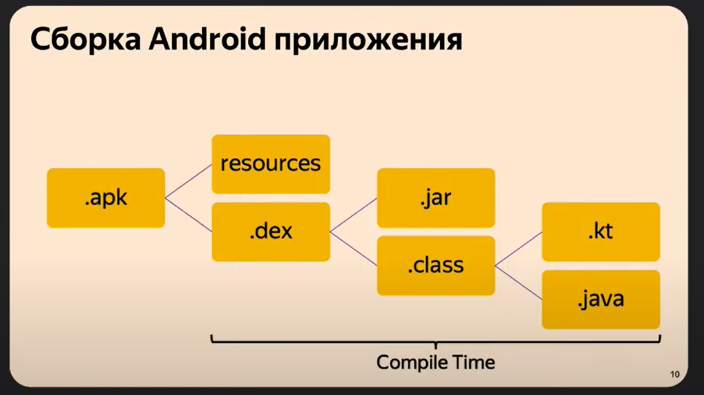

# План
1. Foundamentals
2. Threads
3. java.util.concurrent
4. Android

Обсудим базовые понятия в мире многопоточности, поймём, что такое процесс, что такое поток, рассмотрим примеры того, как можно потоки создавать/отменять, как ими управлять

Далее рассмотрим основные примитивы синхронизации, которые я использую на практике, классные коллекции из java.util.concurrent, которые сильно упрощают нам жизнь в ежедневной разработке

На последок немного затронем тему конкретно Android фреймворка, поймём, какие инструменты есть именно в нём и что мы можем использовать для себя

# `1.` Foundamentals

Этот доклад лишь приоткроет дверь в мир многопоточности, и чтобы действительно научиться писать классный многопоточный код, нужно прочитать большой объём литературы и, самое главное, нужно много практиковаться. В этой теме без практики никуда и вы только по ходу дела, по ходу решения сложных кейсов из мира программирования будете улучшать свои навыки и понимать, когда можно использовать тот или иной инструмент/механизм из многопоточки

Сегодня как раз постараюсь привести примеры, которые смогут вам с этим помочь

`Многопоточность` – способность процессора обеспечивать одновременное выполнение нескольких потоков внутри одного процесса

`Процесс` – экземпляр программы во время выполнения. Независимый объект, которому выделены системные ресурсы. Для нас, как андроид-разработчиков, это означает, что есть конкретное приложение и в рамках этого приложения существует процесс

В рамках процесса существуют `потоки выполнения` – определённые способы выполнения программы. По сути, это набор инструкций, которые выполняются последовательно

## `1.1` Иерархия процессов

OS Android – система на базе Linux, соответственно, можно рассмотреть нашу концепцию процессов с точки зрения линукса

Под процессами можно считать конкретные приложения, хотя у одного приложения могут быть несколько процессов

```
Linux Kernel

    Process A
        PID (process id)
        Address Space
        Memory

    Process B
        PID
        Address Space
        Memory

    Process C
        PID
        Address Space
        Memory
```

## `1.2` Потоки внутри процесса

Внутри процесса будут существовать наши потоки

```
Process A
    
    Thread 1
    
    Thread 2
    
    Thread 3
```

Потоки – это часть процесса, они делят общую память между собой

Тема многопоточности как раз и раскрывает проблему работы с общими данными для потоков и пытается решить многие проблемы, когда мы пытаемся из одного потока получить данные, над которыми работает другой поток

При использовании многоядерных устройств отдельные ядра (грубо говоря, отдельные процессоры) будут работать с нашими процессами, причём могут затрагивать потоки одного и того же процесса по-отдельности. Мы должны это тоже учитывать:

```
        Thread A1   |   Thread B1
CPU 1
        Thread A2   |   Thread B2

---------------------------------

        Thread A3   |   Thread B3
CPU 2
        Thread A4   |   Thread B4

---------------------------------

        Process A   |   Process B
```

## `1.3` Переключение потоков

**Количество потоков не всегда будет улучшать эффективность вашей программы, поскольку потоки работают последовательно в рамках одного процесса**:



Если есть несколько потоков, и они живут в рамках одного конкретного процесса, и обрабатываются на одном ядре, то инструкции в этих потоках будут выполняться не параллельно, а последовательно

То есть сначала выполняем некоторый участок кода в Потоке 1, потом переключаемся в Поток 2, возвращаемся к первому / переключаемся на другие потоки и т.д.

Есть некоторые зазоры между выполнениями задач на том или ином потоке, эти промежутки супер важны. Это то время, которое нужно диспатчеру, чтобы переключиться с одного потока на другой

Если потоков будет не 2, а 1000, то таких промежутков будет сильно больше

То, сколько нужно потоков для максимальной эффективности, можно описать с помощью определённых законов, Например, как Universal Scalability Law – универсальный закон масштабируемости. Можете немножко про это почитать и чуть-чуть углубиться в эту тему

## `1.4` Зачем нужна многопоточность?

Однопоточный код не решает все наши проблемы и задачи

Однопоточные программы имеют недостатки в случаях, когда требуется обработка различных событий и выполнение блокирующих задач

### Специфика Android

В Android наше приложение живёт в одном или более процессах, каждое из которых содержит основной поток под названием `Main Thread`

Он отвечает сразу за несколько важных активностей. В первую очередь, он и только он должен отрисовывать UI. Далее он может обрабатывать какие-то пользовательские действия: нажатия, свайпы. Более того, он и только он отвечает за запуск всех основных компонентов

Как минимум то, что уже перечислено, довольно фундаментальные вещи и под них должно быть выделено много времени. На бекграунд задачи может не хватить времени на главном потоке

Рассмотрим одну из базовых активностей главного потока – отрисовку UI. Главная загвоздка здесь – это уметь вовремя отрисовывать каждый кадр, который пользователь видит на экране