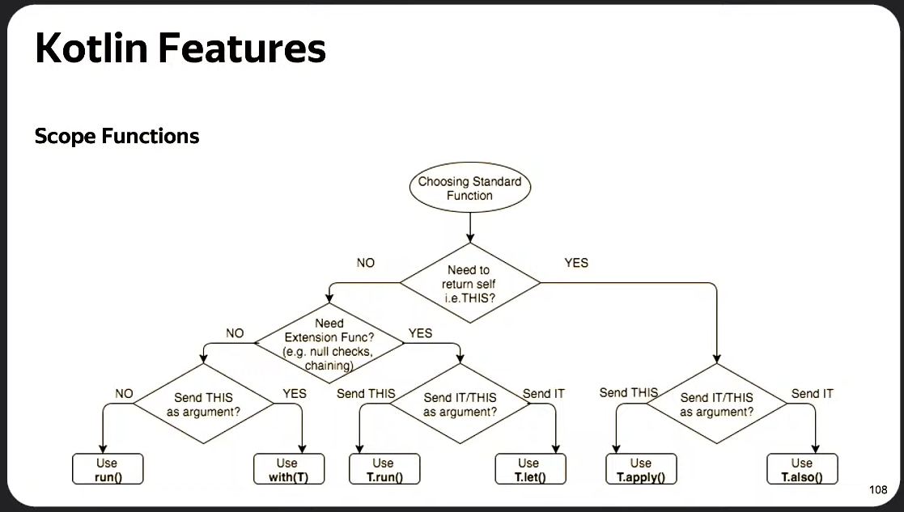

# `Kotlin`
* Мультипарадигменный
* Статически типизированный
* Кроссплатформенный
* Общего назначения

Был разработан как лучшая версия и замена `Java`, для комплияции `bytecode` и для исполнения на `виртуальных машинах`

Но со временем это изменилось и котлин теперь компилируется не только в байткод, но и, например, в `Javascript` для web-разработки, нативный код

Байткод попадает в `VM`, чаще всего в `JVM`, и он уже запускается на различных настоящих машинах (на телефонах, компьютерах, ноутбках), а точнее на разных операционных системах

# Содержание
Ответим на такие вопросы:
* Как собирается приложение?
* Как исполняется приложение?
* Какие возможности доступны в языке и... почему?

Порядок лекции:
1. [`Сборка приложения`](#1-сборка-android-приложения) (как мы его собираем, где исполняем, кто его собирает)

   1.1 [В сборке участвуют три компилятора](#11-в-сборке-участвуют-три-компилятора)

   1.2 [Установка и запуск: AOT и JIT компиляции](#12-установка-и-запуск-aot-и-jit-компиляции)

2. [`Виртуальные машины`](#2-виртуальные-машины)
    
    2.1 [JVM – Java Virtual Machine](#21-jvm--java-virtual-machine)
    
    2.2 [Какая идея стояла за виртуальной машиной](#22-какая-идея-стояла-за-виртуальной-машиной)
    
    2.3 [Dalvik VM (Android 4.4-)](#23-dalvik-vm-andriod-44-)
    
    2.4 [ART (Android 5.0)](#24-art-android-50)
   
    2.5 [ART (Android 7.0)](#25-art-android-70)
   
    2.6 [ART (Android 9.0)](#26-art-android-90)
    
    2.7 [Цикл работы Android Runtime](#27-цикл-работы-android-runtime)
   
    2.8 [Виртуальная машина](#28-виртуальная-машина)
    
    2.9 [Android OS](#29-android-os)
   
    2.10 [App Process подробнее: Java Memory Model](#210-app-process-подробнее-java-memory-model)

3.  [`Компилятор и плагины`](#3-kotlin-compiler)

    3.1 [Kotlin K2 Compiler](#31-kotlin-k2-compiler)

    3.2 [Kotlin K2 Compiler Plugins](#32-kotlin-k2-compiler-plugins)

4.  [`Kotlin Features`](#4-kotlin-features) (Зная всю информацию выше, посмотрим на фичи языка котлин. Так будет понятнее, зачем они нужны и где действительно помогают)

## `1` Сборка Android приложения

1. Есть исходники формата `.kt` и `.java`
2. Из них можем получить байткод формата `.class`
3. Можем добавить различные библиотеки `.jar`
4. Получаем `.dex` файл
5. К нему можем добавить `resources`
6. И всё это упаковывается в `.apk` файл (на самом деле это просто zip-архив. Можно переименовать, разархивировать и посмотреть из чего он состоит)

Всё, что присходит на этапе 1-5 называется `Compile Time`

У Android-разработчика есть 3 времени:
1. `Design Time` – придумывание и написание кода
2. `Compile Time` – код собирается и исполняется различными компиляторами
3. `Run Time` – всё, что происходит при запуске приложения после его сборки

### `1.1` В сборке участвуют три компилятора

1. В первую очередь это `Kotlin Compiler`

   .kt и .java `–>` .class

2. За ним идут ещё два компилятора `dexer` и `shrinker`
   
   .jar и .class `–>` .dex
   
   `dexer d8` – компилятор java-байткода в dex-байткод – формат, в котором умеет исполняться байткод на виртуальных машинах андроида (vm android разные бывают). Главная фишка дексера – дешугаринг. Это такой процесс, когда различные новые фишки языка могут быть скомпилированы с обратной совместимостью с более старыми виртуальными машинами

   `shrinker r8` – компилятор-оптимизатор
   * Удаляет неиспользуемое: код, ресурсы, строки. Это уменьшает размер приложения и ускоряет его работу
   * Оптимизирует код – какие-то участки кода можно писать не самым эффективным способом, а шринкер знает, как  его сделать более эффективным для исполнения на какой-то машине
   * Запутывает код (obfuscation) – приложения можно декомпилировать и достать исходный код. Чтобы ваш код не утекал так легко, его запутывают
3. Далее происходит просто упаковка в .apk

Жизнь приложения на этом только начинается, наступает дистрибуция – его выгружают в `Store`

Опубликованное приложение устанавливается на телефоны

### `1.2` Установка и запуск: AOT и JIT компиляции

При установке происходит ещё одна компиляция – `AOT compilation` (Ahead of Time compilation)

Виртуальные машины работают с `JIT compilation` (Just in Time compilation), а в андроиде начиная с 5-й версии происходит AOT компиляция

Далее приложение запускается – начинается runtime, и в нём работает JIT компиляция

То есть код на этапе сборки уже компилировался тремя компиляторами, а потом он ещё будет продолжать компилироваться всю жизнь, установленную на телефон

Такие этапы:
1. AOT compilation
2. installation
3. Runtime
4. JIT compilation

Ими занимается виртуальная машина, на которой запускается приложение

## `2` Виртуальные машины 

### `2.1` JVM – Java Virtual Machine

Всё запускается на виртуальных машинах. Самая известная – java virtual machine, на её основе строится android virtual machine (с dex-байткодом вместо java-байткода)

Если знать, как устроена JVM, легко узнать и как устроены андроидные машины

### `2.2` Какая идея стояла за виртуальной машиной

Есть исходники, например, на плюсах. Существует много разных компиляторов, которые преобразуют код в машинный код или в код для ОС. Затем он запускается на разных девайсах с разной архитектурой

Но нам как разработчикам не хочется думать, кто и где какую версию запускает

Хочется один раз скомпилировать, отдать и чтоб оно работало

Идея java машины в этом и состоит:
1. Компилируем байткод, получаем .class файлы
2. Отдаём их в виртуальную машину
3. А виртульная машина уже установлена на различных устройствах. И если она там есть, там наш код можно исполнить

То есть идея «что-то сделай один раз и исполняй везде»

### `2.3` Dalvik VM (Andriod 4.4-)
В андроиде не java-байткод, а dex-байткод, и не java virtual machine, а какая-то другая виртуальная машина, которая умеет исполнять .dex файлы

Раньше ей был Dalvik, а потом ART (Android runtime)


Нескомпилированный dex-code занимает мало места, но при запуске приложения весь код нужно постоянно компилировать – это требует ресурсы железа и быстрее сажает батарейку

### `2.4` ART (Android 5.0)

Много кода приложения компилируется заранее во время установки, поэтому приложение работает быстрее и тратит меньше ресурсов

### `2.5` ART (Android 7.0)

Вернули JIT компиляцию, т.к. скомпилировать всё заранее невозможно – стандартная библиотека джавы предоставляется виртуальной машиной, её нельзя скомпилировать заранее

Там есть такие штуки как рефлексия, аннотации, класс лоудеры. Они препятствуют тому, чтобы можно было вычислить, как код ведёт себя в runtime, поэтому приходится его компилировать кусочками в процессе

### `2.6` ART (Android 9.0)

В девятом андроиде пошли дальше

Если есть миллион устройств, которые уже компилируют одно и то же приложение под свои процессоры, можно попытаться поделиться этой информацией между устройствами

`Google Play` как маркет этим занимается. Мы можем ему предоставить некоторый baseline profile (файл, в котором описано, как лучше компилировать наши файлы), с ним AOT compiler знает лучше, как обрабатывать наш код, а дальше приложение на устройстве выполняет JIT компиляцию, собирает информацию во время работы и делится ею с Google Play. Тогда при установке можно отправить ещё один профайл – cloud profile, и девайс получит опыт миллионов других устройств, чтобы запустить приложение, и оно будет работать ещё быстрее

До таких идей доходят в процессе оптимизации работы андроида, поэтому приложения становятся всё быстрее и быстрее в новых версиях

### `2.7` Цикл работы Android Runtime


### `2.8` Виртуальная машина
это система, которая эмулирует аппаратное обеспечение компьютера и исполняет программы. То есть машина внутри другой машины

Бывают разных видов: `системные` и `процессные`


**Системные виртуальные** машины устанавливаются на сервера, часто используются в больших датацентрах

Как эти сервера устроены:
* Есть мощная машина с кучей железа
* На ней запускается симулятор (так часто называют виртуальную машину для серверов)
* На симуляторе устанавливают ОС
* В этой ОС крутятся приложения

И так одну физическую машину можно разграничить на какие-то зоны и получить набор из виртуальных машин, поделив ресурсы физической машины

В андроиде используются **процессные виртуальные машины**. Они устроены чуть иначе:
* Операционная система работает с железом напрямую
* Есть даже какие-то низкоуровневые приложения, которые работают с этой операционной системой (у обычного пользователя нет к ним доступа)
* Рядом устанавливается экземпляр виртуальной машины, внутри которого запускается приложение. Их может создаваться несколько: когда в телефоне запускается 5 приложений, для каждого из них создаётся свой экземпляр виртуальной машины

Документация гугла:


### `2.9` Android OS
Как этой всё запускается?


1. Пользователь запускает что-то в телефоне, происходит событие на запуск приложения
2. Система ловит это событие. Есть специально заготовленный класс `Zygote` (биологический термин). Зиготы делятся – порождается процесс `process.fork()`
3. Отдельный процесс инициализируется:
   
   * Запускается виртуальная машина (`ART VM`)
   * Устанавливается особый обработчик исключений (`ExceptionHandler`), чтобы если ваш процесс испортился, он не повлиял на всю систему
   * Запускается главный поток (`Main Thread`)
   * Происходит связывание сервисов(`Bind Services`) между процессами: в системе работают какие-то сервисы, дающие доступ к драйверам, камере, физическим носителям, к Acitivity-manager и т.д. Обращение к таким штукам не быстрые, часто приводят к зависаниям
4. Когда процесс готов, на нём создаётся единственный класс `Application`
5. В этом Application запускается `Acivity`, `Service`, всё, что указано в манифесте
6. Пользователь это видит и доволен

### `2.10` App Process подробнее: Java Memory Model
он устроен так же, как и JVM. А точнее, он даёт доступ к памяти, а эта память устроена в ART точно так же, как и в JVM. Это называется `Java Memory Model`


* В этой модели есть главный поток и какие-то другие потоки (которые мы создаём для асинхронной работы)
* В потоках мы вызываем методы, выделяем память под переменные и т.д.
* Примерно так строится единый стек вызовов в потоке (`Thread Stack`)
* Отдельная область памяти называется куча (`Heap`). В ней находятся сами объекты, а в стеке только ссылки на них (`references`). Эти ссылки могут идти на общие объекты, могут на разные. Здесь начинается тема следующей лекции про многопоточность

На самом деле всё знание про Java Memory Model про то, как же нам синхронизировать работу этих потоков. Но в этой лекции будем не об этом, а посмотрим повнимательнее, как устроена эта память

#### Какие ошибки могут случиться в стеке:
* `MethodNotFoundException` – метод может быть не найден, потому что почему-то он куда-то не загрузился
* `OutOfMemoryException` – может не хватить памяти, когда мы выделяем место под очередную переменную. Например, когда загружаем большую картинку
* `NullPointerException` – когда наша ссылка больше никуда не указывает
* `StackOverflowException` – выход за границу стека
* `NoClassDefFoundException` – класс не найден при выделении памяти

У стека есть единственное свойство – его размер. Мы можем его задать, если сами запускаем виртуальную машину, при помощи флага `-Xss1024k`

В старых андроидах размер стека был очень маленький:
* API 3 ([Android 1.5](https://android.googlesource.com/platform/dalvik.git/+/4da052510571aea4711d04de25a24b58cab1dadc%5E1..4da052510571aea4711d04de25a24b58cab1dadc/)) = 8 KB
* API 4-10 ([Android 1.6](https://android.googlesource.com/platform/dalvik/+/android-1.6_r1/vm/Thread.h) - [Android 2.3.7](https://android.googlesource.com/platform/dalvik/+/android-2.3.7_r1/vm/Thread.h)) = 12 KB
* API 14-17 ([Android 4.0](https://android.googlesource.com/platform/dalvik/+/android-cts-4.0_r1/vm/Thread.h) - [Android 4.2.2](https://android.googlesource.com/platform/dalvik/+/android-4.2.2_r1.1/vm/Thread.h)) = 16 KB
* Сейчас = 8 MB (не точно, так как размер стека определяют производители андроид устройства)

Размером стека мы не управляем, поэтому нужно аккуратно писать код, быть аккуратными с рекурсиями, использовать хвостовую рекурсию (которая компилируется и разворачивается), внерекурсивные вызовы. Потому что, если что, изменить мы это не сможем – устройства, на которых запускается приложение, у нас не под контролем, в отличии, например от бекенд-разработки, где, если что-то не так, можно поднять размер стека

#### Теперь про кучу – место, где живут сами объекты

Строго говоря, память это не только куча, но и ещё одно пространство – раньше оно называлось `PermGen` (Permanent Generation), сейчас называется `MetaSpace` начиная с восьмой версии Java. В них хранится немного разная информация

Куча это не один сплошной кусок памяти, он делится на поколения: есть молодые и старые


Эти поколения наблюдаются специальной штукой, которая называется `Garbage Collector` (GC). Он их мониторит, удаляет оттуда объекты или перемещает

И даже молодые поколения состоят из нескольких этапов:
* Поколение `Eden` – самое молодое, куда попадает только что созданный объект
* Поколение `S0`
* Поколение `S1`

Они нужны, чтобы GC работал чуть оптимальнее – если бы он запускался на весь Heap, пришлось бы остановить работу приложения, чтобы проанализировать то, что там находится

Мы памятью напрямую не управляем, за нас это делает виртуальная машина при помощи GC

В молодых поколениях объекты нужно собирать чаще, а если объект уже пережил 10-20 сборок, то, наверное, он будет жить и дальше, и такие объекты можно смотреть чуть-чуть реже

Существуют разные GC: какие-то работают параллельно, какие-то останавливают все потоки и идут определять достижимость объектов из памяти. Возможности выбирать GC у нас тоже нет – он зашит на девайсе. Как правило, сейчас работают параллельные, которые работают в фоне

В отличие от Heap, которая является памятью внутри виртуальной машины, MetaSpace – это нативная память (динамическая), она доступна железу напрямую. Там хранятся самые важные вещи для работы приложения, которые почти никогда не должны выгружаться

Например, там хранятся `Class Metadata` – таблицы, где записано, какие методы к каким классам относятся, как они устроены, что позволяет стеку правильно работать. Так же туда предоставляется доступы к классам, которые поступают извне. Например, стандартная библотека Java

В Java и Kotlin есть класслоудеры, которые позволяют что-то добавить или убрать из MetaSpace

В старых версиях (PermGen) эта область была фиксированного размера и это приводило к OutOfMemoryException. MetaSpace динамическая, она расширяется

До Java 8 здесь ещё находился `String Pool`, сейчас он и другие пулы наодятся в Heap

#### Пулы (`Pools`) – области, где хранятся переиспользуемые объекты

Бывают разные: String Pool, Int Pool, Char Pool, Byte Pool, Short Pool

В пуле могут находиться одинаковые по содержанию, но разные по ссылке объекты, если использовать какие-то сложные методы создания объектов:

```kotlin
// String literals
"hello" == "hello"                                      // true
"hello" === "hello"                                     // true

// String builders
"hello" == StringBuiler("hello").toString()             // true
"hello" === StringBuilder("hello").toString()           // false

// Intern from Pool
"hello" === StringBuilder("hello").toString().intern()  // true
```

В котлине '==' это проверка на равенство по содержанию, а '===' по ссылке

StringBuilder генерирует строку как объект, поэтому созданные так строки по содержанию эквивалентны, а по ссылке разные

Существует метод `intern()` (интернирование), он говорит "не надо создавать новый объект, сложи его в пул, а если в пуле уже лежит этот объект, достань его оттуда". Тогда по ссылке они будут одинаковы

В Int Pool есть ограничение в 1 байт. Если все числа попадают в 1 байт, они будут браться из пула, если числа больше размером, то они будут браться откуда-то снаружи (будут создаваться новые объекты в куче)

```kotlin
val a: Int? = 127
val b: Int? = 127

a == b                  // true
a === b                 // true

val c: Int? = 128
val d: Int? = 128

c == d                  // true
c === d                 // false
```

В этом примере специально использован nullable тип, чтобы обмануть комплиятор. Примитивные типы данных хранятся напрямую в стеке и не выделяют никаких ссылок в кучу. А объектные типы с ссылкой заставляют создать объект, и тогда компилятор создаёт их

С интами идея простая: в вашем коде некоторые числа используются гораздо чаще, чем другие. И чтобы под них выделить заранее объекты и не создать десяток одинаковых существует пул

Все эти пулы нужны для оптимизации потребления памяти, скорости работы виртуальной машины

#### GC – определение мусора

Как определить, какой объект является мусором?


Для этого существует понятие `GC Roots`. Они позволяют понять, что собрать, а что удалить

GC Root – это точка старта, откуда GC будет обходить ссылки и вычислять достижимость объектов. Если объект достижим – он живой, если нет – надо его убирать. GC видит всё, он отмечает достижимые объекты, а всё остальное попадает в мусор. GC Root находится вне кучи

Здесь существует ловушка, в которую разработчики могут попасть


Например, Object 2 уже не используется, но где-то утекла ссылка. Такая утёкшая ссылка называется `утечкой памяти` (memory leak). Она транзитивно может переходить и на другие объекты и не давать очистить огромный кусок памяти. За такими вещами надо следить


В реальном примере это могли бы быть классы Application, Activity, EventListener

У нас есть Activity, у неё есть UI Element, и мы в Application устанавливаем какой-то глобальный Listener, который меняет кнопку. Если забыть убрать ссылку из Application на этот Listener, то Activity никогда не очистится

Поэтому нужно быть аккуратным, в разных LifeCycle-зависимых методах снимать ссылки симметрично и следить за утечками

Несмотря на то, что GC за нами всё чистит, наша задача – следить, чтобы никакая ссылка не утекла

## `3` Компилятор и плагины

### `3.1` Kotlin K2 Compiler

Компилятор – программа, переводящая написанный на языке программирования текст в набор машинных кодов

Для нас это чёрный ящик. Мы подаём в него исходники, зависимости, флаги и настройки, а на выходе он даёт скомпилированный код – для нас это байткод (.class, .js, .so)

Текущая версия компилятора Котлина называется Kotlin K2 Compiler, вышла стабильная версия в конце мая 2024 года

Внутри компилятор работает в две фазы: `Frontend` и `Backend`

На фронтенде анализируется код, правильно ли он написан, стоит ли с ним дальше работать. Если неправильно, то где именно, а если правильно, то пытается понять его смысл – получить семантику

То есть фронтенд пытается понять смысл написанного вами кода. Если этот смысл понятен, то, наверное, бэкенд справится с его переводом в байткод

Бэкендов существует много разных, фронтенд – один. Бэкенд, с которым работаем мы, называется `JVM IR` (Intermediate Representation). Для джаваскрипта другой бэкенд – JS IR, для нативного кода – Native, для WebAssembly – WASM

Как устроен фронтенд:
1. У нас есть исходники, на выходе должны получить семантику
2. `Parser`: эти исходники мы будем парсить, то есть разбирать на токены

   Пример:
   ```kotlin
   private val kotlinFiles = mutableListOf(1, 2, 3)
   ``` 
   разобъётся на
   ```kotlin
   Private
   Var
   kotlinFiles
   ArrayList
   Int(1), Int(2), Int(3)
   ```
3. `Syntax Analysis`: эти токены будем проверять на синтаксические ошибки (как диктант в школе)
4. `Fir Builder`: дальше пытаемся построить смысл – строим `PSI` дерево. Это представление хранится в памяти, но его можно сериализовать – записать на файловую систему. Так, например, реализуется кеш компилятора (он не будет перекомпилировать не изменившиеся файлы)
5. `Resolution`: если с деревом всё ок, можно из него получить семантическое представление, в которую ещё на фазе резолюции подставим какие-то дополнительные штуки
6. Получим на выходе файл `FIR` (Frontend Intermediate Representation)

Перед отправкой на бэкенд, FIR преобразуется инструментом `fir2ir` для упрощения работы бэкенда. Дальше бэкенд генерирует итоговый файл

Bytecode Generator –> .class

JavaScript Generator –> .js

Native Code Generator –> .so

У каждого бэкенда отличается только генератор кода, ну и на выходе они дают разный результат

На лекции был краткий пересказ статьи с Хабра про Kotlin K2 Compiler https://habr.com/ru/companies/kts/articles/813085/

Компилятор котлина устроен очень здорово. Принципы разработки, которые там использованы, полезны в повседневной жизни – можно вдохновиться тем, как сделан компилятор и в вашем коде тоже что-то реализовть по такой схеме

### `3.2` Kotlin K2 Compiler Plugins

К компилятору можно подключать плагины на любом этапе работы компилятора: и в синтаксический анализ, и перед ним, и при генерации дерева. Давайте разбираться на примерах, что такое плагины. Мы с ними имеем дело постоянно:

#### <u>***Kotlin Compose Plugin***</u>

Compose работает в паре с компилятором. Аннотации типа @Composable очень часто намекают на то, что где-то используется рефлексия или плагин компилятора котлина

Рассмотрим типичную Composable функцию
```kotlin
@Composable
fun Counter() {
    var count by remember() { mutableStateOf(0) }
    Button(
        text = "Count: $count",
        onPress = { count += 1 }
    )
}
```

После работы плагина, этот код превращается в такой:
```kotlin
fun Counter($composer: Composer) {
    $composer.start(123)
    var count by remember($composer) { mutableStateOf(0) }
    Button(
        $composer,
        text = "Count: $count",
        onPress = { count += 1 }
    )
    $composer.end()
}
```

Пропала аннотация, появился обрамляющий весь код composer. Его подстановкой занимается плагин

Плагин позволяет скрыть от разработчиков захламляющую информацию (что называется boilerplate), чтобы концентрироваться только на значимых вещах

Первый код гораздо понятнее читается и видна суть написанного

#### ***<u>kotlinx.serialization Plugin***</u>

Этот плагин тоже при помощи аннотаций и специального класса `Json` позволяет генерировать из вашего дата класса json-представление (чтобы, например, отправлять его в Сеть)

```kotlin
@Serializable
data class Project(
    val name: String,
    val owner: Account,
    val group: String = "R&D"
)

@Serializable
data class Account(val userName: String)

val moonshot = Project("Moonshot", Account("Jane"))
val cleanup = Project("Cleanup", Account("Mike"),  "Maintenance")

fun main() {
    val string = Json.encodeToString { listOf(moonshot, cleanup) }
    println(string)
    // [{"name":"Moonshot","owner":{"userName":"Jane"}},{"name":"Cleanup","owner":{"userName":"Mike"},"group":"Maintenance"}]

    val projectCollection = Json.decodeFromString<List<Project>>(string)
    println(projectCollection)
    // [Project(name=Moonshot, owner=Account(userName=Jane), group=R&D), Project(name=Cleanup, owner=Account(userName=Mike), group=Maint)]
}
```

Раньше для этого использовали различные библиотеки, сейчас делают просто с помощью плагина. Логично, ведь есть схема дата класса, мы знаем какие поля там есть – наверное можно сгенерировать код, который превращает его в строку с какой-то специфичной структурой. Собственно, kotlinx.serialization это делаает. И при помощи класса Json мы можем либо закодировать data class в json-представление, либо из строки декодировать обратно и получить data class

#### ***<u>ksp (Kotlin symbol processing)***</u>

– API Kotlin для написания плагинов компилятора

В целом, ksp довольно простая вещь, за которой скрывается очень мощный инструмент. На самом деле, работая с ksp вам не надо до конца понимать, как устроены плагины или как их писать, какие этапы у компилятора есть

ksp работает где-то в середине frontend части компиляции

Чтобы сделать свой плагин на котлине, нам надо воспользоваться фреймворком SymbolProcessorProvider – создать SymbolProcessor. У него есть две части:
* Resolver – API для чтения файлов, он возвращает классы:
  * KSFile
  * KSDeclaration
  * KSAnnotation
  * KSValueArgument

* SymbolProcessorEnvironment (окружение) – API для генерации файлов, что-то типа контекста в андроиде 
   ```kotlin
   codeGenerator.createNewFile(
       filename = "generated",
       extension = "kt",
   )
   ```

Рассмотрим на примере: допустим, мы хотим создать аннотацию, которой мы будем размечать в коде файлы, и мы хотим все эти файлы собрать в список

Это можно применять к Activity, т.к. их всегда нужно регистрировать в манифесте. А вам может быть лень это делать, вы бы хотели, чтобы кодогенератор сам их туда прописал. Поэтому для начала можно хотя бы собрать все такие файлы в единый список, может быть полезно

В Музыке мы такое делали. У нас есть аннотация Experiment – feature toggle (закрывает кусок кода). Раньше у нас постоянно возникали конфликты во время разработки из-за того, что разработчики в один и тот же файл добавляют новые и новые эксперименты, их может быть сотни, а символ процессор эту проблему решил – каждый разметил свой файл, чужие файлы не трогаются, и никому не надо думать, кто в каком порядке туда добавил

```kotlin
SymbolProcessor {
    override fun process(resolver: Resolver): List<KSAnnotated> {
        val symbols = resolver.getSymbolsWithAnnotation("com.yandex.MyAnnotation")
      
        val declarations = findAnnotatedFiles(symbols)
      
        if (declarations.isNotEmpty()) {
            createFile(declarations)
        }

        return symbols
           .filterNot { it.validate() }
           .toList()
    }
}

private fun findAnnotatedFiles(symbols: Sequence<KSAnnotated>): List<KSDeclaration> { 
    return symbols
        .filter { it.validate() }
        .filterIsInstance<KSClassDeclaration>()
        .toList()
}

private fun createFile(
    declarations: Sequence<KSDeclaration>,
    annotatedFileInfos: List<AnnotatedFileInfo>,
) {
    val file = codeGenerator.createNewFile(
        Dependencies(
            aggregating = true,
            sources = declarations.mapNotNull { it.containingFile }
                .distinct()
                .toList()
                .toTypedArray(),
        ),
        packageName = "com.school.ksp.example",
        fileName = "SchoolAnnotationRegistry"
    )

    file.bufferedWriter().use {
        generateCode(annotatedFileInfos).writeTo(it)
    }
}
```

Делается это с помощью резолвера. Где-то в коде мы завели свою аннотацию и из резолвера мы можем достать все файлы, размеченные аннотацией. Что можно с ними сделать:
   * Например, достать только классы, размеченные аннотацией (аннотацию можно вешать и на методы)
      ```kotlin
      .filterIsInstance<KSClassDeclaration>()
      ```

   * Так же можно посмотреть KSMethod, KSField, KSClass, KSProperty 

Посмотрим, как собрать все файлы в список:
1. В первом блоке генерим лист. `ControlFlow` это фигурные скобки (то есть блок кода, который исполняется). Открываем ControlFlow, который называется buildList (то есть будет вызов функции buildList). Внутри этих фигурных скобок будем добавлять классы, которые нашли. Надо найти имя класса, который был отмечен аннотацией. Здесь доступен шаблонизатор `%T`, можем с помощью него подставить это имя + "()"
2. Этот лист нужно куда-то сохранить. Создаём объект с помощью `objectBuilder()` (`classBuilder()` может создать класс, нам достаточно object), создаём у него переменную files типа List с параметром T = ClassName, в инициализаторе указываем блок, который выше описывали

```kotlin
val buildListBlock = CodeBlock.builder()
    .beginControlFlow("buildList")
    .apply {
        files.forEach { file ->
            addStatement("add(%T())", ClassName(file.packageName, file.simpleName))
        }
    }
    .endControlFlow()
    .build()

return FileSpec.builder(packageName, "Registry")
    .addType(
        TypesSpec.objectBuilder("Registry")
            .addProperty(
                PropertySpec.builder("files", List::class.asClassName().parametrizedBy("ClassName"))
                .initializer(buildListBlock)
                .build()
            )
           .build()
    )
    .build()
```

И на выходе получим такой объект

```kotlin
public object Registry {
    public val files: List<ClassName> = buildList {
        add(SomeClassName())
        add(AnotherClassName())
    }
}
```

Примерно так работает ksp. Как видите, не надо обладать большой базой, чтобы работать с ним. Здесь происходит только чтение и запись, больше ничего сложного там нет

Когда мы сгенерировали файл, главное не забыть вернуть символы (код, который анализировался) обратно следующему процессору (они работают по цепочке, ksp плагинов может быть много, каждый следующий обрабатывает какой-то поток, то есть они друг на друга влиюят)

```kotlin
SymbolProcessor {
    ...

    return symbols
        .filterNot { it.validate() }
        .toList()
}
```

Подведём итоги ksp плагина:
1. Это API Kotlin для написания плагинов компилятора
2. Писать плагины для котлина можно на котлине
   
   (котлин пишется на котлине, и компилятор котлина пишется на котлине)

3. Достаточно простой синтаксис 

    (в сравнении с тем, как пишутся обычные плагины)

4. Похож на рефлексию
   
   Отличие в том, что рефлексия работает в runtime и требует обращения в MetaSpace, а обрашаться туда сложно. Из-за рефлексии мы не можем использовать AOT компиляцию, поэтому её приходится процессить в JIT. Рефлексия медленная. Но если мы проделаем всю работу рефлексии заранее, напишем код, сгенерируем его из многих файлов, это будет гораздо лучше. Мы как разработчики не хотим писать boilerplate code, поэтому компилятор и плагин сделают это за нас. В целом, ksp можно рассматривать как рефлексию на стероидах

5. Но ksp не позволяет нам менять уже написанный код, как можно было в рефлексии. Мы можем только посмотреть и создать что-то дополнительное новое. Для остального нужно писать уже более сложные плагины с API написания плагинов. Тем не менее, при помощи ksp можно сделать очень многое

## `4` Kotlin Features

Фич гораздо больше, чем описано здесь, но эти на мой взгляд ключевые. Они позволяют писать код удобнее, чем это было раньше. Делают Котлин современным языком, который выбирают всё больше разработчиков даже с других платформ

### `4.1` Extension Functions

Расширение API класса. Это возможность вызывать функции над классами, даже если у нас нет доступа к ним внутрь

Например, объявить над интом функцию возведения в квадрат и вызывать её в синтаксисе, как будто она была где-то внутри

```kotlin
fun Int.squared(): Int = this * this
val result = 5.squared()
```

На этом построены прикольные апишки, например, библиотека kotlintime. Мы можем работать с классом Duration, просто указывая "10.seconds". Это гораздо читаемее, чем duration(10) – вызывать функцию, которая возвращает Duration, и отдавать туда 10
```kotlin
val duration: Duration = 10.seconds
duration.toComponents { minutes, seconds, nanos -> 
    println("Went: $minutes mins $seconds secs and $nanos nanos")
}
```

Благодаря этому можно перевернуть код и он будет читаться как книга, а не как исходники на плюсах

Так же и вы можете строить расширения над библиотеками или классами, которые используете, и получать более читаемый и простой код

В конечном счётё, на Extension функциях строится DSL код: например, можно build файлы для андроида писать на котлине

### `4.2` Scope Functions

Функции, которые меняют `this` внутри блока, или создают изолированный блок, позволяющий там внутри создать переменные и работать с ними

| Function | Object reference | Return value   | Is extension function                       |
| :------- | :--------------- | :------------- | :------------------------------------------ |
| `let`    | it               | Lambda         | Yes                                         |
| `run`    | this             | Lambda         | Yes                                         |
| `run`    | -                | Lambda         | No: called without the context object       |
| `with`   | this             | Lambda result  | No: takes the context object as an argument |
| `apply`  | this             | Context object | Yes                                         |
| `also`   | it               | Context object | Yes                                         |

https://kotlinlang.org/docs/scope-functions.html



Используем `run` вместо `if`, чтобы записать код лаконичнее

Допустим, функция использует только non-nullable тип, но исторически nullable тоже приходят. В блоке run это объясняем
```kotlin
fun test(arg: Any?) {
    val validArg = arg ?: run {
        prinln("argument is null!")
        return
    }

    println("do the job with $validArg")
}
```

Или, например, хотим собрать список, добавить туда какие-то значения. `apply` позволяет не писать `List.add()`, `List.add()`, `List.add()`, в этом кусочке кода видим только самую суть

```kotlin
ArrayList<Any>().apply {
    add(5)
    add("6")
    add(7.0)
}
```

Или, например, у нас есть список пользователей, мы их фильтруем, но код работает неправильно. Мы хотим проверить, как выглядит результат где-то посередине. Обычно надо завести промежуточную переменную, её куда-то распечатать. `also` позволяет вклиниться в середину этого процесса

```kotlin
fun process(users: List<String?>): List<Int> {
    return users
        .filterNotNull()
        .also { println("filtered to $it") }
        .map { it.length }
}
```

Но у Scope функций есть проблема. Язык даёт возможность одно и то же записать 2-3-4 способами, и если использовать их неправильно, можно только запутать. Слишком большая гибкость. Можно вложить run в apply, apply в run и понять, какая переменная под this подразумевается, будет очень сложно

Поэтому нужно спрашивать себя "Подходит ли эта функция сюда? Стал ли код читаемее? Не будет понятнее просто использовать if?"

### `4.3` Functional Types
### `4.4` Sealed Classes
### `4.5` Null Safety
### `4.6` Special Types
### `4.7` Mutable / Immutable Collections
### `4.8` Generics